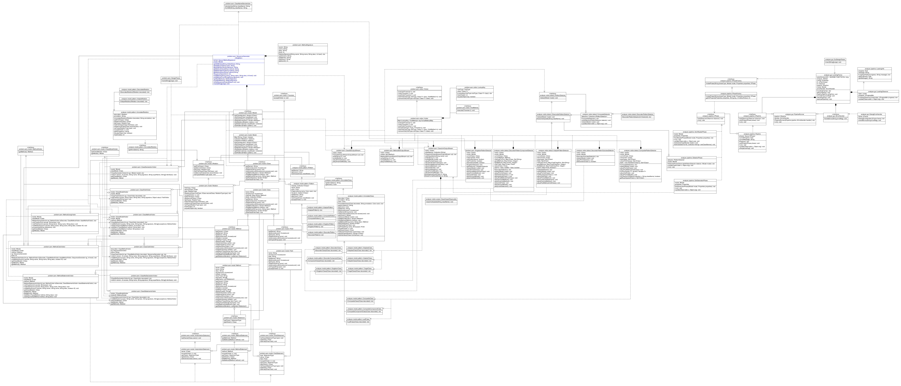

# asm-analyzer
Git repository for CSSE374 project

Authors:

Steven Kneisler (Github: Stevenator1)

Christian Schulz (Github: Whirligig231)

# Description

asm-analyzer is a program that uses the ASM library to produce an automatic UML diagram of a class structure. Use it by passing as command-line arguments to DesignParser the full names of the classes you want the analyzer to diagram. These must be included in the build path. For instance, "lab13.problem.FileEvent" is a valid parameter. If you provide multiple classes, the analyzer will also search for relationships between them.

asm-analyzer also includes a tool for automated sequence diagrams using the SDEdit format. To use this tool, pass SequenceGenerator an argument containing the full signature of the method, without the return type but including everything else, with fully qualified class names, e.g. "java.lang.String.substring(int, int)" is a valid parameter. Optionally, pass a second argument indicating the number of levels of method calls to show; this defaults to 5.

# Design (UML Class Diagram)

# Features

asm-analyzer's UML diagram tool currently supports:

- Classes and interfaces
- Public, private, protected, and default modifiers
- Methods and fields
- Method signatures and field types
- Inheritance and implementation relationships

asm-analyzer's sequence diagram tool currently supports only class method calls, with no control structure.

# Use

To use asm-analyzer's UML diagram tool, pass DesignParser.main a list of class names you want to include in the diagram. This must be a fully qualified name, including the package.

To use asm-analyzer's sequence diagram tool, pass SequenceGenerator.main a fully qualified method signature, including the owner class (with its package), the method name, and fully qualified argument types (but *not* the return type).

# Design and implementation

## Milestone 1

The UML diagram tool has two main layers, each of which is an instance of the Visitor pattern. In the first layer, the program uses ASM visitors to traverse the classes and their methods and fields. These visitors decorate one another to access and handle different parts of the class, building a problem.asm.model.Class model structure. Note that in order to pass the structure through decorators, we need to ensure that the decorator implements the IClassHolder interface, allowing its decorators to access its current model. Christian performed the modifications to the ClassVisitor code required to implement this.

Each class is thus converted to a Class model structure, implemented by Christian. Then, a second Visitor, implemented by Steven, traverses this class model structure in order to convert it to a DOT source file, analogous to the XML car traverser we implemented in Lab 3-1. Christian, having prior experience with DOT, helped with some of the string parsing required to build the DOT source.

The code also has automated unit tests, implemented by Steven, which test the code by using some example classes to verify that the Visitors give the expected output.

## Milestone 2

In this milestone, we added support for use and association arrows. Christian changed the structure of the class model to accommodate this, adding an additional level of structure, IModel, which contains IClass classes and IRelation arrow objects. Arrows are now created as IRelation objects, with an enum to indicate the type of arrow.

Steven helped to add these additional arrows to the DOT conversion visitor and revised the unit tests.

## Milestone 3

In this milestone, sequence diagramming was added. This code works by keeping a queue of which methods need to be found. The code, created by Christian, visits these methods' classes, finds the appropriate methods, and adds them into the model. Christian also added a calls list for each method, giving the calls to other methods that it makes.

Christian then proceeded to create two new visitors, ClassSDOutputStream and MethodSDOutputStream, which are used to generate sequence diagrams. ClassSDOutputStream traverses the IModel in a similar manner to ClassUmlOutputStream to create SDEdit declarations for all of the classes. MethodSDOutputStream finds the specific method that the SequenceGenerator gives it and recursively visits all of the methods that it calls.

Steven, meanwhile, refactored our visitor code to use the Command pattern, so that we can continue to develop visitors for our IModel model without having a large number of different visit() methods, with different signatures, in IVisitor and VisitorAdapter. In the new design, VisitorAdapter is replaced by Visitor, a concrete class, and the various OutputStream classes compose a Visitor rather than extending one.